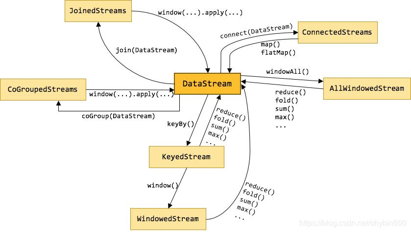

# FLINK DATASTREAM常用算子

* Flink中的算子是将一个或多个DataStream转换为新的DataStream，可以将多个转换组合成复杂的数据流拓扑。

* 在Flink中，有多种不同的DataStream类型，他们之间是使用各种算子进行的。如下图所示：



* MAP map可以理解为映射，对每个元素进行一定的变换后，映射为另一个元素。

举例：

```aidl
package operators;

import org.apache.flink.streaming.api.datastream.DataStream;
import org.apache.flink.streaming.api.environment.StreamExecutionEnvironment;

//这个例子是监听9000 socket端口，对于发送来的数据，以\n为分隔符分割后进行处理，
//将分割后的每个元素，添加上一个字符串后，打印出来。
public class MapDemo {
private static int index = 1;
public static void main(String[] args) throws Exception {
//1.获取执行环境配置信息
StreamExecutionEnvironment env = StreamExecutionEnvironment.getExecutionEnvironment();
//2.定义加载或创建数据源（source）,监听9000端口的socket消息
DataStream<String> textStream = env.socketTextStream("localhost", 9000, "\n");
//3.map操作。
DataStream<String> result = textStream.map(s -> (index++) + ".您输入的是：" + s);
//4.打印输出sink
result.print();
//5.开始执行
env.execute();
}
}
```

* FLATMAP flatmap可以理解为将元素摊平，每个元素可以变为0个、1个、或者多个元素。

举例：

```aidl
package operators;

import org.apache.flink.api.common.typeinfo.Types;
import org.apache.flink.streaming.api.datastream.DataStream;
import org.apache.flink.streaming.api.environment.StreamExecutionEnvironment;
import org.apache.flink.util.Collector;

//这个例子是用Flink监听9000端口，将接受的字符串用\n分割为一个个的元素
//然后将每个元素拆为一个个的字符，并打印出来
public class FlatMapDemo {
private static int index1 = 1;
private static int index2 = 1;

    public static void main(String[] args) throws Exception {
        //1.获取执行环境配置信息
        StreamExecutionEnvironment env = StreamExecutionEnvironment.getExecutionEnvironment();
        //2.定义加载或创建数据源（source）,监听9000端口的socket消息
        DataStream<String> textStream = env.socketTextStream("localhost", 9000, "\n");
        //3.flatMap操作，对每一行字符串进行分割
        DataStream<String> result = textStream.flatMap((String s, Collector<String> collector) -> {
            for (String str : s.split("")) {
                collector.collect(str);
            }
        })
        //这个地方要注意，在flatMap这种参数里有泛型算子中。
        //如果用lambda表达式，必须将参数的类型显式地定义出来。
        //并且要有returns，指定返回的类型
        //详情可以参考Flink官方文档：https://ci.apache.org/projects/flink/flink-docs-release-1.6/dev/java_lambdas.html
        .returns(Types.STRING);

        //4.打印输出sink
        result.print();
        //5.开始执行
        env.execute();
    }
}
```

* FILTER filter是进行筛选。

举例：

```aidl
package operators;

import org.apache.flink.streaming.api.datastream.DataStream;
import org.apache.flink.streaming.api.environment.StreamExecutionEnvironment;

public class FilterDemo {
private static int index = 1;
public static void main(String[] args) throws Exception {
//1.获取执行环境配置信息
StreamExecutionEnvironment env = StreamExecutionEnvironment.getExecutionEnvironment();
//2.定义加载或创建数据源（source）,监听9000端口的socket消息
DataStream<String> textStream = env.socketTextStream("localhost", 9000, "\n");
//3.filter操作，筛选非空行。
DataStream<String> result = textStream.filter(line->!line.trim().equals(""));
//4.打印输出sink
result.print();
//5.开始执行
env.execute();
}
}
```

* KEYBY 逻辑上将Stream根据指定的Key进行分区，是根据key的散列值进行分区的。

举例：

```aidl
package operators;

import org.apache.flink.api.common.typeinfo.Types;
import org.apache.flink.api.java.tuple.Tuple2;
import org.apache.flink.streaming.api.datastream.DataStream;
import org.apache.flink.streaming.api.environment.StreamExecutionEnvironment;
import org.apache.flink.streaming.api.windowing.time.Time;

import java.util.concurrent.TimeUnit;

//这个例子是每行输入一个单词，以单词为key进行计数
//每10秒统计一次每个单词的个数
public class KeyByDemo {
public static void main(String[] args) throws Exception {
//1.获取执行环境配置信息
StreamExecutionEnvironment env = StreamExecutionEnvironment.getExecutionEnvironment();
//2.定义加载或创建数据源（source）,监听9000端口的socket消息
DataStream<String> textStream = env.socketTextStream("localhost", 9000, "\n");
//3.
DataStream<Tuple2<String, Integer>> result = textStream
//map是将每一行单词变为一个tuple2
.map(line -> Tuple2.of(line.trim(), 1))
//如果要用Lambda表示是，Tuple2是泛型，那就得用returns指定类型。
.returns(Types.TUPLE(Types.STRING, Types.INT))
//keyBy进行分区，按照第一列，也就是按照单词进行分区
.keyBy(0)
//指定窗口，每10秒个计算一次
.timeWindow(Time.of(10, TimeUnit.SECONDS))
//计算个数，计算第1列
.sum(1);
//4.打印输出sink
result.print();
//5.开始执行
env.execute();
}
}
```

* REDUCE reduce是归并操作，它可以将KeyedStream 转变为 DataStream。

```aidl
package operators;

import org.apache.flink.api.common.typeinfo.Types;
import org.apache.flink.api.java.tuple.Tuple2;
import org.apache.flink.streaming.api.datastream.DataStream;
import org.apache.flink.streaming.api.environment.StreamExecutionEnvironment;
import org.apache.flink.streaming.api.windowing.time.Time;

import java.util.concurrent.TimeUnit;

//这个例子是对流进行分组，分组后进归并操作。
//是wordcount的另外一种实现方法
public class ReduceDemo {
public static void main(String[] args) throws Exception {
//1.获取执行环境配置信息
StreamExecutionEnvironment env = StreamExecutionEnvironment.getExecutionEnvironment();
//2.定义加载或创建数据源（source）,监听9000端口的socket消息
DataStream<String> textStream = env.socketTextStream("localhost", 9000, "\n");
//3.
DataStream<Tuple2<String, Integer>> result = textStream
//map是将每一行单词变为一个tuple2
.map(line -> Tuple2.of(line.trim(), 1))
//如果要用Lambda表示是，Tuple2是泛型，那就得用returns指定类型。
.returns(Types.TUPLE(Types.STRING, Types.INT))
//keyBy进行分区，按照第一列，也就是按照单词进行分区
.keyBy(0)
//指定窗口，每10秒个计算一次
.timeWindow(Time.of(10, TimeUnit.SECONDS))
//对每一组内的元素进行归并操作，即第一个和第二个归并，结果再与第三个归并...
.reduce((Tuple2<String, Integer> t1, Tuple2<String, Integer> t2) -> new Tuple2(t1.f0, t1.f1 + t2.f1));
        //4.打印输出sink
        result.print();
        //5.开始执行
        env.execute();
    }
}
```

* FOLD 给定一个初始值，将各个元素逐个归并计算。它将KeyedStream转变为DataStream。

举例：

```aidl
package operators;

import org.apache.flink.api.common.typeinfo.Types;
import org.apache.flink.api.java.tuple.Tuple2;
import org.apache.flink.streaming.api.datastream.DataStream;
import org.apache.flink.streaming.api.environment.StreamExecutionEnvironment;
import org.apache.flink.streaming.api.windowing.time.Time;

import java.util.concurrent.TimeUnit;

public class FoldDemo {
public static void main(String[] args) throws Exception {
//1.获取执行环境配置信息
StreamExecutionEnvironment env = StreamExecutionEnvironment.getExecutionEnvironment();
//2.定义加载或创建数据源（source）,监听9000端口的socket消息
DataStream<String> textStream = env.socketTextStream("localhost", 9000, "\n");
//3.
DataStream<String> result = textStream
//map是将每一行单词变为一个tuple2
.map(line -> Tuple2.of(line.trim(), 1))
//如果要用Lambda表示是，Tuple2是泛型，那就得用returns指定类型。
.returns(Types.TUPLE(Types.STRING, Types.INT))
//keyBy进行分区，按照第一列，也就是按照单词进行分区
.keyBy(0)
//指定窗口，每10秒个计算一次
.timeWindow(Time.of(10, TimeUnit.SECONDS))
//指定一个开始的值，对每一组内的元素进行归并操作，即第一个和第二个归并，结果再与第三个归并...
.fold("结果：",(String current, Tuple2<String, Integer> t2) -> current+t2.f0+",");

        //4.打印输出sink
        result.print();
        //5.开始执行
        env.execute();
    }
}
```

* UNION union可以将多个流合并到一个流中，以便对合并的流进行统一处理。是对多个流的水平拼接。参与合并的流必须是同一种类型。

举例：

```aidl
package operators;

import org.apache.flink.streaming.api.datastream.DataStream;
import org.apache.flink.streaming.api.environment.StreamExecutionEnvironment;

//这个例子是将三个socket端口发送来的数据合并到一个流中
//可以对这三个流发送来的数据，集中处理。
public class UnionDemo {
public static void main(String[] args) throws Exception {
//1.获取执行环境配置信息
StreamExecutionEnvironment env = StreamExecutionEnvironment.getExecutionEnvironment();
//2.定义加载或创建数据源（source）,监听9000端口的socket消息
DataStream<String> textStream9000 = env.socketTextStream("localhost", 9000, "\n");
DataStream<String> textStream9001 = env.socketTextStream("localhost", 9001, "\n");
DataStream<String> textStream9002 = env.socketTextStream("localhost", 9002, "\n");

        DataStream<String> mapStream9000=textStream9000.map(s->"来自9000端口："+s);
        DataStream<String> mapStream9001=textStream9001.map(s->"来自9001端口："+s);
        DataStream<String> mapStream9002=textStream9002.map(s->"来自9002端口："+s);

        //3.union用来合并两个或者多个流的数据，统一到一个流中
        DataStream<String> result =  mapStream9000.union(mapStream9001,mapStream9002);

        //4.打印输出sink
        result.print();
        //5.开始执行
        env.execute();
    }
}
```

* JOIN 根据指定的Key将两个流进行关联。

举例

```aidl
package operators;

import org.apache.flink.api.common.functions.MapFunction;
import org.apache.flink.api.java.tuple.Tuple2;
import org.apache.flink.streaming.api.datastream.DataStream;
import org.apache.flink.streaming.api.environment.StreamExecutionEnvironment;
import org.apache.flink.streaming.api.windowing.assigners.TumblingProcessingTimeWindows;
import org.apache.flink.streaming.api.windowing.time.Time;

public class WindowJoinDemo {
public static void main(String[] args) throws Exception {
//1.获取执行环境配置信息
StreamExecutionEnvironment env = StreamExecutionEnvironment.getExecutionEnvironment();

        //2.定义加载或创建数据源（source）,监听9000端口的socket消息
        DataStream<String> textStream9000 = env.socketTextStream("localhost", 9000, "\n");
        DataStream<String> textStream9001 = env.socketTextStream("localhost", 9001, "\n");
        //将输入处理一下，变为tuple2
        DataStream<Tuple2<String,String>> mapStream9000=textStream9000
                .map(new MapFunction<String, Tuple2<String,String>>() {
                    @Override
                    public Tuple2<String, String> map(String s) throws Exception {
                        return Tuple2.of(s,"来自9000端口："+s);
                    }
                });

        DataStream<Tuple2<String,String>> mapStream9001=textStream9001
                .map(new MapFunction<String, Tuple2<String,String>>() {
                    @Override
                    public Tuple2<String, String> map(String s) throws Exception {
                        return Tuple2.of(s,"来自9001端口："+s);
                    }
                });

        //3.两个流进行join操作，是inner join，关联上的才能保留下来
        DataStream<String> result =  mapStream9000.join(mapStream9001)
                //关联条件，以第0列关联（两个source输入的字符串）
                .where(t1->t1.getField(0)).equalTo(t2->t2.getField(0))
                //以处理时间，每10秒一个滚动窗口
                .window(TumblingProcessingTimeWindows.of(Time.seconds(10)))
                //关联后输出
                .apply((t1,t2)->t1.getField(1)+"|"+t2.getField(1))
                ;

        //4.打印输出sink
        result.print();
        //5.开始执行
        env.execute();
    }
}
```

* COGROUP 关联两个流，关联不上的也保留下来。

举例：

```aidl
package operators;

import org.apache.flink.api.common.functions.CoGroupFunction;
import org.apache.flink.api.common.functions.MapFunction;
import org.apache.flink.api.java.tuple.Tuple2;
import org.apache.flink.streaming.api.datastream.DataStream;
import org.apache.flink.streaming.api.environment.StreamExecutionEnvironment;
import org.apache.flink.streaming.api.windowing.assigners.TumblingProcessingTimeWindows;
import org.apache.flink.streaming.api.windowing.time.Time;
import org.apache.flink.util.Collector;

public class CoGroupDemo {
public static void main(String[] args) throws Exception {
//1.获取执行环境配置信息
StreamExecutionEnvironment env = StreamExecutionEnvironment.getExecutionEnvironment();

        //2.定义加载或创建数据源（source）,监听9000端口的socket消息
        DataStream<String> textStream9000 = env.socketTextStream("localhost", 9000, "\n");
        DataStream<String> textStream9001 = env.socketTextStream("localhost", 9001, "\n");
        //将输入处理一下，变为tuple2
        DataStream<Tuple2<String, String>> mapStream9000 = textStream9000
                .map(new MapFunction<String, Tuple2<String, String>>() {
                    @Override
                    public Tuple2<String, String> map(String s) throws Exception {
                        return Tuple2.of(s, "来自9000端口：" + s);
                    }
                });

        DataStream<Tuple2<String, String>> mapStream9001 = textStream9001
                .map(new MapFunction<String, Tuple2<String, String>>() {
                    @Override
                    public Tuple2<String, String> map(String s) throws Exception {
                        return Tuple2.of(s, "来自9001端口：" + s);
                    }
                });

        //3.两个流进行coGroup操作,没有关联上的也保留下来，功能更强大
        DataStream<String> result = mapStream9000.coGroup(mapStream9001)
                //关联条件，以第0列关联（两个source输入的字符串）
                .where(t1 -> t1.getField(0)).equalTo(t2 -> t2.getField(0))
                //以处理时间，每10秒一个滚动窗口
                .window(TumblingProcessingTimeWindows.of(Time.seconds(10)))
                //关联后输出
                .apply(new CoGroupFunction<Tuple2<String, String>, Tuple2<String, String>, String>() {
                    @Override
                    public void coGroup(Iterable<Tuple2<String, String>> iterable, Iterable<Tuple2<String, String>> iterable1, Collector<String> collector) throws Exception {
                        StringBuffer stringBuffer = new StringBuffer();
                        stringBuffer.append("来自9000的stream:");
                        for (Tuple2<String, String> item : iterable) {
                            stringBuffer.append(item.f1 + ",");
                        }
                        stringBuffer.append("来自9001的stream:");
                        for (Tuple2<String, String> item : iterable1) {
                            stringBuffer.append(item.f1 + ",");
                        }
                        collector.collect(stringBuffer.toString());
                    }
                });

        //4.打印输出sink
        result.print();
        //5.开始执行
        env.execute();
    }
}
```

* CONNECT 参考：https://www.jianshu.com/p/5b0574d466f8

将两个流纵向地连接起来。DataStream的connect操作创建的是ConnectedStreams或BroadcastConnectedStream，它用了两个泛型，即不要求两个dataStream的element是同一类型。

举例：

```aidl
package operators;

import org.apache.flink.api.java.tuple.Tuple2;
import org.apache.flink.streaming.api.datastream.DataStream;
import org.apache.flink.streaming.api.datastream.SingleOutputStreamOperator;
import org.apache.flink.streaming.api.environment.StreamExecutionEnvironment;
import org.apache.flink.streaming.api.functions.co.CoMapFunction;

import java.util.regex.Matcher;
import java.util.regex.Pattern;

public class ConnectDemo {
public static void main(String[] args) throws Exception {
//1.获取执行环境配置信息
StreamExecutionEnvironment env = StreamExecutionEnvironment.getExecutionEnvironment();
//2.定义加载或创建数据源（source）,监听9000端口的socket消息
DataStream<String> textStream9000 = env.socketTextStream("localhost", 9000, "\n");
DataStream<String> textStream9001 = env.socketTextStream("localhost", 9001, "\n");
//转为Integer类型流
DataStream<Integer> intStream = textStream9000.filter(s -> isNumeric(s)).map(s -> Integer.valueOf(s));
//连接起来，分别处理，返回同样的一种类型。
SingleOutputStreamOperator result = intStream.connect(textStream9001)
.map(new CoMapFunction<Integer, String, Tuple2<Integer, String>>() {
@Override
public Tuple2<Integer, String> map1(Integer value) throws Exception {
return Tuple2.of(value, "");
}

                    @Override
                    public Tuple2<Integer, String> map2(String value) throws Exception {
                        return Tuple2.of(null, value);
                    }
                });
        //4.打印输出sink
        result.print();
        //5.开始执行
        env.execute();
    }

    private static boolean isNumeric(String str) {
        Pattern pattern = Pattern.compile("[0-9]*");
        Matcher isNum = pattern.matcher(str);
        if (!isNum.matches()) {
            return false;
        }
        return true;
    }
}
```

* SPLIT 参考：https://cloud.tencent.com/developer/article/1382892

将一个流拆分为多个流。

```aidl
package operators;

import org.apache.flink.api.common.typeinfo.Types;
import org.apache.flink.api.java.tuple.Tuple2;
import org.apache.flink.streaming.api.datastream.DataStream;
import org.apache.flink.streaming.api.datastream.SplitStream;
import org.apache.flink.streaming.api.environment.StreamExecutionEnvironment;

import java.util.ArrayList;
import java.util.List;
import java.util.regex.Matcher;
import java.util.regex.Pattern;

public class SplitDemo {
public static void main(String[] args) throws Exception {
//1.获取执行环境配置信息
StreamExecutionEnvironment env = StreamExecutionEnvironment.getExecutionEnvironment();
//2.定义加载或创建数据源（source）,监听9000端口的socket消息
DataStream<String> textStream = env.socketTextStream("localhost", 9000, "\n");
//3.
SplitStream<Tuple2<String, Integer>> result = textStream
//map是将每一行单词变为一个tuple2
.map(line -> Tuple2.of(line.trim(), 1))
//如果要用Lambda表示是，Tuple2是泛型，那就得用returns指定类型。
.returns(Types.TUPLE(Types.STRING, Types.INT))
.split(t -> {
List<String> list = new ArrayList<>();
//根据逻辑拆分，并定义outputName
if (isNumeric(t.f0)) {
list.add("num");
} else {
list.add("str");
}
return list;
});
//选择指定名称的流
DataStream<Tuple2<String, Integer>> strSplitStream = result.select("str")
.map(t -> Tuple2.of("字符串：" + t.f0, t.f1))
.returns(Types.TUPLE(Types.STRING,Types.INT));
//选择指定名称的流
DataStream<Tuple2<String, Integer>> intSplitStream = result.select("num")
.map(t -> Tuple2.of("数字：" + t.f0, t.f1))
.returns(Types.TUPLE(Types.STRING,Types.INT));

        //4.打印输出sink
        strSplitStream.print();
        intSplitStream.print();
        //5.开始执行
        env.execute();
    }

    private static boolean isNumeric(String str) {
        Pattern pattern = Pattern.compile("[0-9]*");
        Matcher isNum = pattern.matcher(str);
        if (!isNum.matches()) {
            return false;
        }
        return true;
    }
}
```
