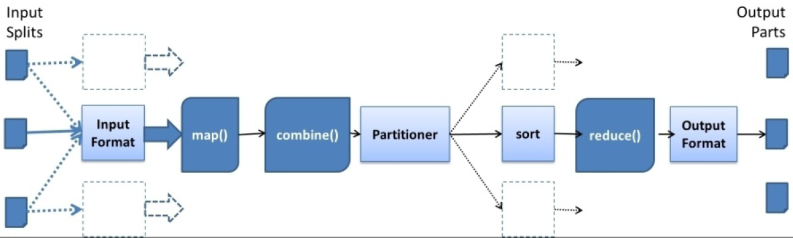

# Hadoop MapReduce架构

* 介绍

  > MapReduce是一种用于处理大量数据的软件框架和编程模型。 MapReduce程序工作分为两个阶段，即Map和Reduce。 Map任务并发地处理数据的分割和映射，而Reduce任务则是shuffle和Reduce数据。       
  > Hadoop能够运行用各种语言编写的MapReduce程序：Java、Ruby、Python和c++。 云计算中的Map Reduce程序本质上是并行的，因此对于在集群中使用多台机器进行大规模数据分析非常有用。       
  > 每个阶段的输入是key-value对。此外，还需要开发人员来指定两个函数：map函数和reduce函数

* MapReduce架构

  > MapReduce计算模型的整个过程经历四个阶段：分割、映射、变换和还原

    
  __工作流__  
  

  