# flink 基本概念

* JOB MANAGER & TASK MANAGER
  > Flink 运行时由两种类型的进程组成：至少一个 JobManager 和一个或者多个 TaskManager。 在高可用（HA）模式中，可能有多个 JobManager，其中一个始终是 leader，其他的则是 standby。

* Flink集群启动方式
  > 直接在机器上作为standalone 集群启动  
  > 在容器中启动  
  > 通过YARN或Kubernetes等资源框架管理并启动

* JobManager
  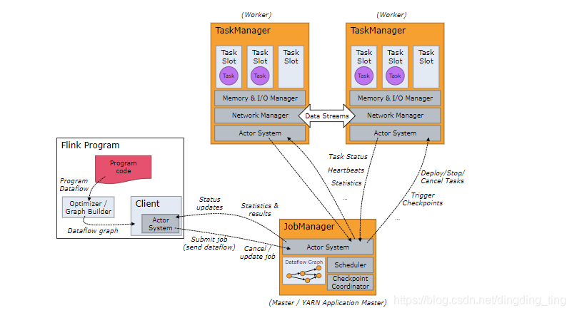
  > 协调 Flink 应用程序的分布式执行。它决定何时调度下一个 task（或一组 task）
  > 对完成的 task 或执行失败做出反应、协调 checkpoint、并且协调从失败中恢复等等。这个进程由三个不同的组件组成

    ```aidl
    ResourceManager： 负责 Flink 集群中的资源提供、回收、分配 。 它管理 task slots，这是 Flink 集群中资源调度的单位。Flink 为不同的环境和资源提供者（例如 YARN、Kubernetes 和 standalone 部署）实现了对应的 ResourceManager。
    Dispatcher：提供了一个 REST 接口，用来提交 Flink 应用程序执行，并为每个提交的作业启动一个新的 JobMaster。它还运行 Flink WebUI 用来提供作业执行信息。
    JobMaster：负责管理单个JobGraph的执行。Flink 集群中可以同时运行多个作业，每个作业都有自己的 JobMaster
    ```

* TaskManager
  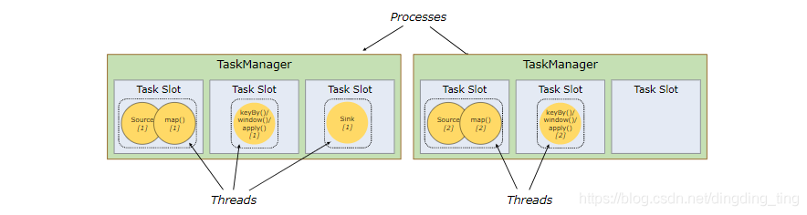
  > TaskManager：执行作业流的 task，并且缓存和交换数据流。在 TaskManager 中资源调度的最小单位是 task slot。TaskManager 中 task slot 的数量表示并发处理 task 的数量

* Flink程序中设定并行度有4种级别:
  > 从低到高分别为：算子级别、执行环境（ExecutionEnvironment）级别、客户端（命令行）级别、配置文件（flink-conf.yaml）级别。实际执行时，优先级则是反过来的，算子级别最高。简单示例如下。

  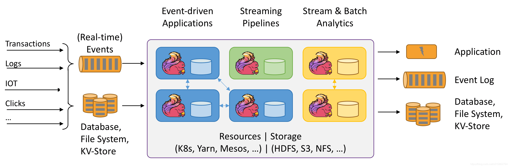


* 数据类型
  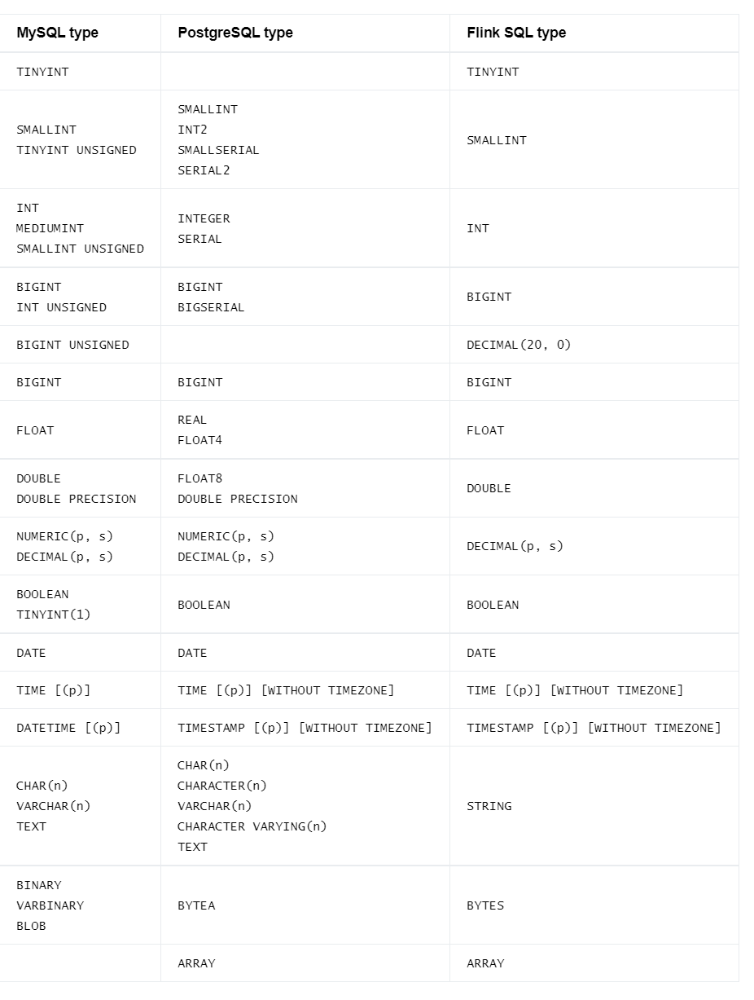

* TABLE API连接器

    * JDBC
      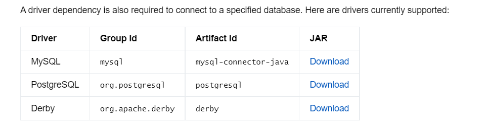

    * UPSERT-KAFKA
      > https://blog.csdn.net/u010834071/article/details/113057879
    * KAFKA
    * HBASE
    * ELASTIC_SEARCH
    * HIVE

* DataStream 连接器
    * JDBC
    * KAFKA
    * CASSANDRA
    * ELASTIC_SEARCH
    * FILE_SYSTEM
    * RABBITMQ

* 批处理 DataSet
  > 使用env.fromElements()，这种方式也支持Tuple，自定义对象等复合形式。
  > 使用env.fromCollection(),这种方式支持多种Collection的具体类型。
  > 使用env.generateSequence(),这种方法创建基于Sequence的DataSet。

```aidl
    import org.apache.flink.api.scala.ExecutionEnvironment 
    import scala.collection.mutable 
    import scala.collection.mutable.{ArrayBuffer, ListBuffer}
    
    /**
    * 读取集合中的批次数据
      */ object BatchFromCollection { def main(args: Array[String]): Unit = {
      //获取flink执行环境 val env = ExecutionEnvironment.getExecutionEnvironment
      //导入隐式转换 import org.apache.flink.api.scala._
      //0.用element创建DataSet(fromElements)
      val ds0: DataSet[String] = env.fromElements("spark", "flink")
      ds0.print()
      //1.用Tuple创建DataSet(fromElements)
      val ds1: DataSet[(Int, String)] = env.fromElements((1, "spark"), (2, "flink"))
      ds1.print()
      //2.用Array创建DataSet val ds2: DataSet[String] = env.fromCollection(Array("spark", "flink"))
      ds2.print()
      //3.用ArrayBuffer创建DataSet val ds3: DataSet[String] = env.fromCollection(ArrayBuffer("spark", "flink"))
      ds3.print()
      //4.用List创建DataSet val ds4: DataSet[String] = env.fromCollection(List("spark", "flink"))
      ds4.print()
      //5.用List创建DataSet val ds5: DataSet[String] = env.fromCollection(ListBuffer("spark", "flink"))
      ds5.print()
      //6.用Vector创建DataSet val ds6: DataSet[String] = env.fromCollection(Vector("spark", "flink"))
      ds6.print()
      //7.用Queue创建DataSet val ds7: DataSet[String] = env.fromCollection(mutable.Queue("spark", "flink"))
      ds7.print()
      //8.用Stack创建DataSet val ds8: DataSet[String] = env.fromCollection(mutable.Stack("spark", "flink"))
      ds8.print()
      //9.用Stream创建DataSet（Stream相当于lazy List，避免在中间过程中生成不必要的集合） val ds9: DataSet[String] = env.fromCollection(Stream("spark"
      , "flink"))
      ds9.print()
      //10.用Seq创建DataSet val ds10: DataSet[String] = env.fromCollection(Seq("spark", "flink"))
      ds10.print()
      //11.用Set创建DataSet val ds11: DataSet[String] = env.fromCollection(Set("spark", "flink"))
      ds11.print()
      //12.用Iterable创建DataSet val ds12: DataSet[String] = env.fromCollection(Iterable("spark", "flink"))
      ds12.print()
      //13.用ArraySeq创建DataSet val ds13: DataSet[String] = env.fromCollection(mutable.ArraySeq("spark", "flink"))
      ds13.print()
      //14.用ArrayStack创建DataSet val ds14: DataSet[String] = env.fromCollection(mutable.ArrayStack("spark", "flink"))
      ds14.print()
      //15.用Map创建DataSet val ds15: DataSet[(Int, String)] = env.fromCollection(Map(1 -> "spark", 2 -> "flink"))
      ds15.print()
      //16.用Range创建DataSet val ds16: DataSet[Int] = env.fromCollection(Range(1, 9))
      ds16.print()
      //17.用fromElements创建DataSet val ds17: DataSet[Long] = env.generateSequence(1, 9)
      ds17.print()
      } 
    }
    
```

* 流处理 DataStream
  > 基于本地集合的source（Collection-based-source）    
  > 基于文件的source（File-based-source）- 读取文本文件，即符合 TextInputFormat 规范的文件，并将其作为字符串返回  
  > 基于网络套接字的source（Socket-based-source）- 从 socket 读取。元素可以用分隔符切分。    
  > 自定义的source（Custom-source）

```aidl
import org.apache.flink.streaming.api.scala.{DataStream, StreamExecutionEnvironment}
import org.apache.flink.streaming.api.scala._
import scala.collection.immutable.{Queue, Stack}
import scala.collection.mutable
import scala.collection.mutable.{ArrayBuffer, ListBuffer}

object StreamingDemoFromCollectionSource {
  def main(args: Array[String]): Unit = {
    val senv = StreamExecutionEnvironment.getExecutionEnvironment
    //0.用element创建DataStream(fromElements)
    val ds0: DataStream[String] = senv.fromElements("spark", "flink")
    ds0.print()
    //1.用Tuple创建DataStream(fromElements)
    val ds1: DataStream[(Int, String)] = senv.fromElements((1, "spark"), (2, "flink"))
    ds1.print()
    //2.用Array创建DataStream
    val ds2: DataStream[String] = senv.fromCollection(Array("spark", "flink"))
    ds2.print()
    //3.用ArrayBuffer创建DataStream
    val ds3: DataStream[String] = senv.fromCollection(ArrayBuffer("spark", "flink"))
    ds3.print()
    //4.用List创建DataStream
    val ds4: DataStream[String] = senv.fromCollection(List("spark", "flink"))
    ds4.print()
    //5.用List创建DataStream
    val ds5: DataStream[String] = senv.fromCollection(ListBuffer("spark", "flink"))
    ds5.print()
    //6.用Vector创建DataStream
    val ds6: DataStream[String] = senv.fromCollection(Vector("spark", "flink"))
    ds6.print()
    //7.用Queue创建DataStream
    val ds7: DataStream[String] = senv.fromCollection(Queue("spark", "flink"))
    ds7.print()
    //8.用Stack创建DataStream
    val ds8: DataStream[String] = senv.fromCollection(Stack("spark", "flink"))
    ds8.print()
    //9.用Stream创建DataStream（Stream相当于lazy List，避免在中间过程中生成不必要的集合）
    val ds9: DataStream[String] = senv.fromCollection(Stream("spark", "flink"))
    ds9.print()
    //10.用Seq创建DataStream
    val ds10: DataStream[String] = senv.fromCollection(Seq("spark", "flink"))
    ds10.print()
    //11.用Set创建DataStream(不支持)
    //val ds11: DataStream[String] = senv.fromCollection(Set("spark", "flink"))
    //ds11.print()
    //12.用Iterable创建DataStream(不支持)
    //val ds12: DataStream[String] = senv.fromCollection(Iterable("spark", "flink"))
    //ds12.print()
    //13.用ArraySeq创建DataStream
    val ds13: DataStream[String] = senv.fromCollection(mutable.ArraySeq("spark", "flink"))
    ds13.print()
    //14.用ArrayStack创建DataStream
    val ds14: DataStream[String] = senv.fromCollection(mutable.ArrayStack("spark", "flink"))
    ds14.print()
    //15.用Map创建DataStream(不支持)
    //val ds15: DataStream[(Int, String)] = senv.fromCollection(Map(1 -> "spark", 2 -> "flink"))
    //ds15.print()
    //16.用Range创建DataStream
    val ds16: DataStream[Int] = senv.fromCollection(Range(1, 9))
    ds16.print()
    //17.用fromElements创建DataStream
    val ds17: DataStream[Long] = senv.generateSequence(1, 9)
    ds17.print()
    senv.execute(this.getClass.getName)
  }
}

```

* 输入和输出 Source 为待处理数据的输入地，而 Sink 为处理后的输出地，目前 Flink 支持的 Source 和 Sink 有：

  > Apache Kafka (source/sink)  
  > Apache Cassandra (sink)  
  > Amazon Kinesis Streams (source/sink)  
  > Elasticsearch (sink)  
  > Hadoop FileSystem (sink)  
  > RabbitMQ (source/sink)  
  > Apache NiFi (source/sink)  
  > Twitter Streaming API (source)  
  > Apache ActiveMQ (source/sink)  
  > Apache Flume (sink)  
  > Redis (sink)  
  > Akka (sink)  
  > Netty (source)


* checkpoint: Flink 自动周期生成，用于用户程序出故障时，使其重置回到正确的状态，主要需做两件事

  > 保存source中流的偏移量( eg. kafka数据的便宜量，以便数据重放)  
  > 保存中间的计算状态( 即StateBackend，这个保存的位置可以选择，后面再讲)

* savepoint: 需要应用自己手动生成，通常用于状态版本控制。依赖于checkpoint机制。

  > MemoryStateBackend  
  > 快速，但是不稳定，重启就没了。  
  > RocksDBStateBackend  
  > 支持增量，支持大状态长窗口的大数据存储，但是存储和读取时都需要序列化(会耗时)  
  > FsStateBackend   
  > 支持大状态长窗口的大数据存储，但是还是会保存一份在 TaskManager 的 Memory 中，所以状态的大小不能超过 TaskManager 的内存

* 表连接器

  > https://nightlies.apache.org/flink/flink-docs-release-1.14/zh/docs/connectors/table/formats/overview/

  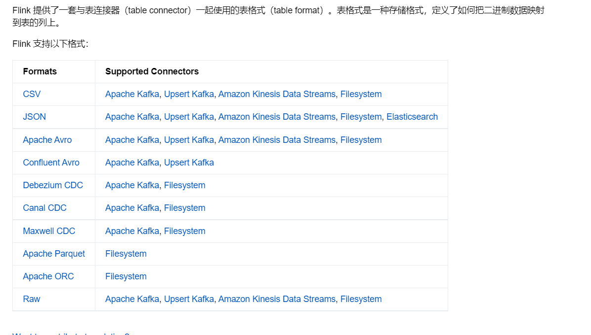

* 部署方式

  > flink的yarn模式部署也分为两种方式，一种是yarn-session，一种是yarn-per-job       
  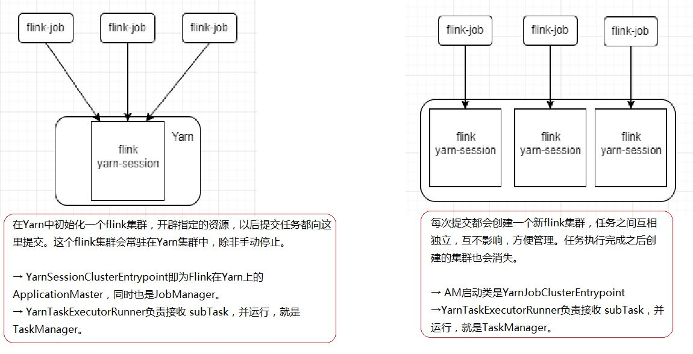

>

* FLINK 应用
  > 实时数据同步  
  > 流式 ETL  
  > 实时数据分析  
  > 复杂事件处理

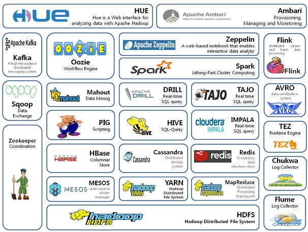

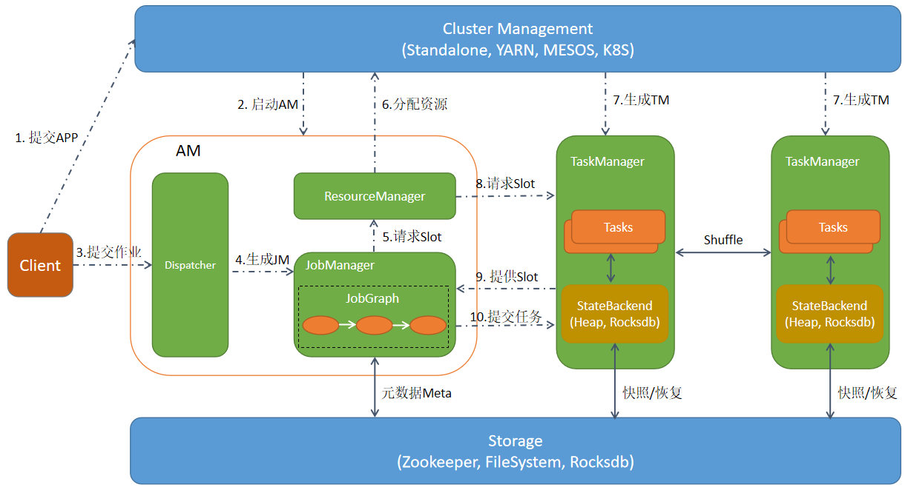

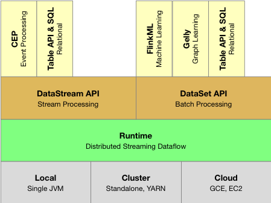
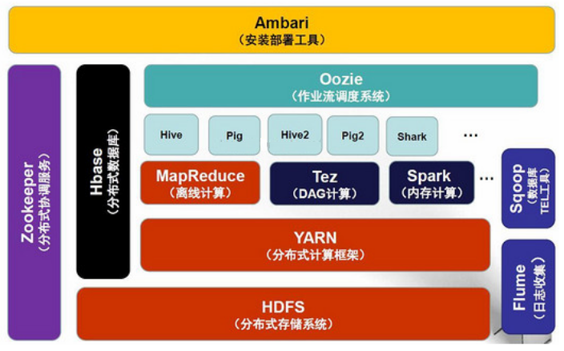

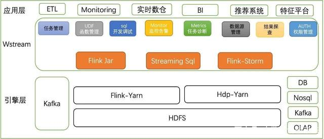

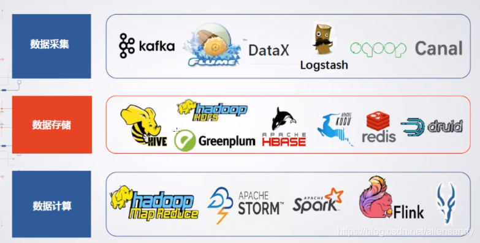

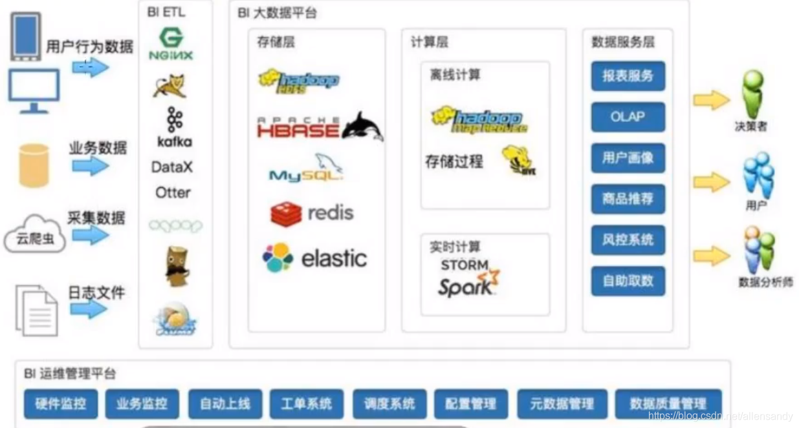


  