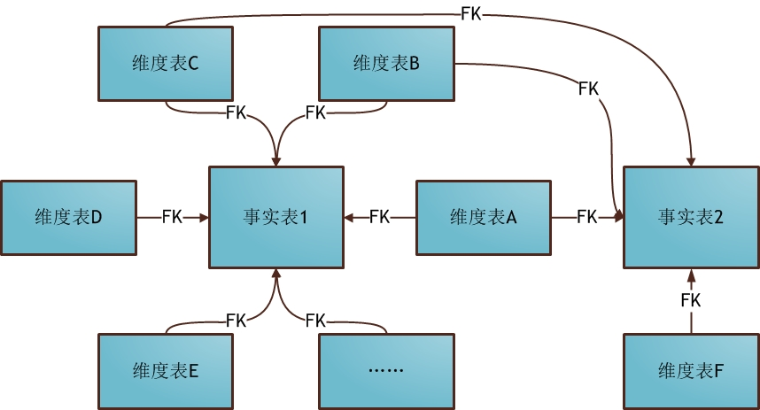
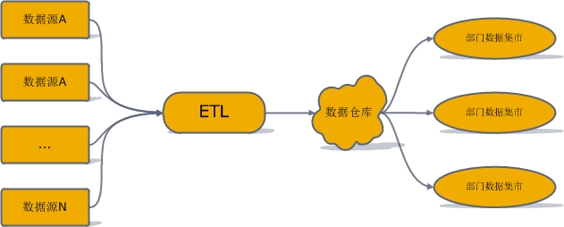

# 数据仓库

* 概念

  > https://www.cnblogs.com/muchen/p/5305658.html

* 数据仓库组件
  

* 数据仓库开发流程

  

* 数据库的 分家

  > 1. 操作型数据库 主要用于业务支撑。一个公司往往会使用并维护若干个数据库，这些数据库保存着公司的日常操作数据，比如商品购买、酒店预订、学生成绩录入等；
  > 2. 分析型数据库  
       主要用于历史数据分析。这类数据库作为公司的单独数据存储，负责利用历史数据对公司各主题域进行统计分析； 那么为什么要"分家"？在一起不合适吗？能不能构建一个同样适用于操作和分析的统一数据库？

* 操作型数据库 VS 分析型数据库

  > 1. 数据组成差别 - 数据时间范围差别 一般来讲，操作型数据库只会存放90天以内的数据，而分析型数据库存放的则是数年内的数据。这点也是将操作型数据和分析型数据进行物理分离的主要原因。
  > 2. 数据组成差别 - 数据细节层次差别 操作型数据库存放的主要是细节数据，而分析型数据库中虽然既有细节数据，又有汇总数据，但对于用户来说，重点关注的是汇总数据部分。 操作型数据库中自然也有汇总需求，但汇总数据本身不存储而只存储其生成公式。这是因为操作型数据是动态变化的，因此汇总数据会在每次查询时动态生成。 而对于分析型数据库来说，因为汇总数据比较稳定不会发生改变，而且其计算量也比较大(因为时间跨度大)，因此它的汇总数据可考虑事先计算好，以避免重复计算。
  > 3. 数据组成差别 - 数据时间表示差别 操作型数据通常反映的是现实世界的当前状态；而分析型数据库既有当前状态，还有过去各时刻的快照，分析型数据库的使用者可以综合所有快照对各个历史阶段进行统计分析。
  > 4. 技术差别 - 查询数据总量和查询频度差别 操作型查询的数据量少而频率多，分析型查询则反过来，数据量大而频率少。要想同时实现这两种情况的配置优化是不可能的，这也是将两类数据库物理分隔的原因之一。
  > 5. 技术差别 - 数据更新差别 操作型数据库允许用户进行增，删，改，查；分析型数据库用户则只能进行查询。
  > 6. 技术差别 - 数据冗余差别 数据的意义是什么？就是减少数据冗余，避免更新异常。而如5所述，分析型数据库中没有更新操作。因此，减少数据冗余也就没那么重要了。 现在回到开篇是提到的第二个问题"某大公司Hadoop Hive里的关系表不完全满足完整/参照性约束，也不完全满足范式要求，甚至第一范式都不满足。这种情况正常吗？"，答曰是正常的。因为Hive是一种数据仓库，而数据仓库和分析型数据库的关系非常紧密(后文会讲到)。它只提供查询接口，不提供更新接口，这就使得消除冗余的诸多措施不需要被特别严格地执行了。
  > 7. 功能差别 - 数据读者差别 操作型数据库的使用者是业务环境内的各个角色，如用户，商家，进货商等；分析型数据库则只被少量用户用来做综合性决策。
  > 8. 功能差别 - 数据定位差别 这里说的定位，主要是指以何种目的组织起来。操作型数据库是为了支撑具体业务的，因此也被称为"面向应用型数据库"；分析型数据库则是针对各特定业务主题域的分析任务创建的，因此也被称为"面向主题型数据库"。

* 维度建模的基本概念

  > 1. 维度表(dimension)
       表示对分析主题所属类型的描述。比如"昨天早上张三在京东花费200元购买了一个皮包"。那么以购买为主题进行分析，可从这段信息中提取三个维度：时间维度(昨天早上)，地点维度(京东), 商品维度(皮包)。通常来说维度表信息比较固定，且数据量小。

  > 2. 事实表(fact table)
       表示对分析主题的度量。比如上面那个例子中，200元就是事实信息。事实表包含了与各维度表相关联的外码，并通过JOIN方式与维度表关联。事实表的度量通常是数值类型，且记录数会不断增加，表规模迅速增长。 注：在数据仓库中不需要严格遵守规范化设计原则(具体原因请看上篇)。本文示例中的主码，外码均只表示一种对应关系，此处特别说明。

* 维度建模的三种模式

1. 星形模式

   

   > a. 维表只和事实表关联，维表之间没有关联；  
   > b. 每个维表的主码为单列，且该主码放置在事实表中，作为两边连接的外码；  
   > c. 以事实表为核心，维表围绕核心呈星形分布；

---

2. 雪花模式

   

---

3. 星座模式

   

---

* 数据仓库

  

---

# ETL：抽取、转换、加载

* ETL工作的实质就是从各个数据源提取数据，对数据进行转换，并最终加载填充数据到数据仓库维度建模后的表中。只有当这些维度/事实表被填充好，ETL工作才算完成。接下来分别对抽取，转换，加载这三个环节进行讲解：

  > 1. 抽取(Extract)
       数据仓库是面向分析的，而操作型数据库是面向应用的。显然，并不是所有用于支撑业务系统的数据都有拿来分析的必要。因此，该阶段主要是根据数据仓库主题、主题域确定需要从应用数据库中提取的数。 具体开发过程中，开发人员必然经常发现某些ETL步骤和数据仓库建模后的表描述不符。这时候就要重新核对、设计需求，重新进行ETL。正如数据库系列的这篇中讲到的，任何涉及到需求的变动，都需要重头开始并更新需求文档。

  > 2. 转换(Transform)
       转换步骤主要是指对提取好了的数据的结构进行转换，以满足目标数据仓库模型的过程。此外，转换过程也负责数据质量工作，这部分也被称为数据清洗(data cleaning)。数据质量涵盖的内容可具体参考这里。

  > 3. 加载(Load)
       加载过程将已经提取好了，转换后保证了数据质量的数据加载到目标数据仓库。加载可分为两种L：首次加载(first load)和刷新加载(refresh load)。其中，首次加载会涉及到大量数据，而刷新加载则属于一种微批量式的加载。

---

---  