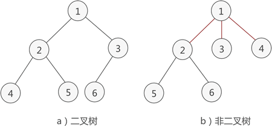
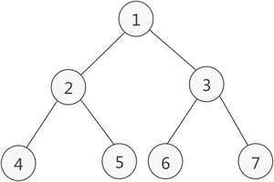
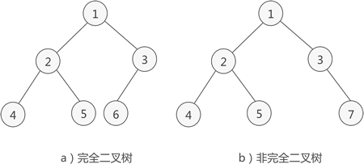
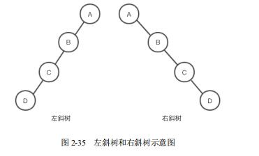
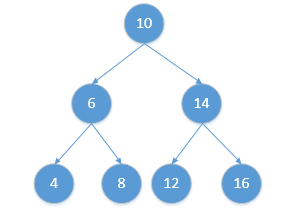

# 🌴 TREE DATASTRUCTURE

#### 🌲 BINARY TREE

> 

* 📙性质
  > * 二叉树中，第 i 层最多有 2i-1 个结点
  > * 如果二叉树的深度为 K，那么此二叉树最多有 2K-1 个结点
  > * 二叉树中，终端结点数（叶子结点数）为 n0，度为 2 的结点数为 n2，则 n0=n2+1
* 二叉树分类
    * 🔴满二叉树  
      
        * 性质
          > * 满二叉树中第 i 层的节点数为 2n-1 个
          > * 深度为 k 的满二叉树必有 2k-1 个节点 ，叶子数为 2k-1
          > * 满二叉树中不存在度为 1 的节点，每一个分支点中都两棵深度相同的子树，且叶子节点都在最底层
          > * 具有 n 个节点的满二叉树的深度为 log2(n+1)

    * 🔴完全二叉树  
      
        * 性质
          > * 当 i>1 时，父亲结点为结点 [i/2] 。（i=1 时，表示的是根结点，无父亲结点）
          > * 如果 2*i>n（总结点的个数） ，则结点 i 肯定没有左孩子（为叶子结点）；否则其左孩子是结点 2*i 。
          > * 如果 2*i+1>n ，则结点 i 肯定没有右孩子；否则右孩子是结点 2*i+1
    * 🔴斜树  
        
      
* 📙遍历  
  
    * 先序遍历
    * 中序遍历
    * 后序遍历
    * 层序遍历

    * 总结
        - 前序遍历：根结点—>左子结点—>右子结点，10、6、4、8、14、12、16
        - 中序遍历：左子结点—>根结点—>右子结点，4、6、8、10、12、14、16
        - 后序遍历：左子结点—>右子结点—>根结点，4、8、6、12、16、14、10
        - 层序遍历：第一层—>第二层—>第n层，10、6、14、4、8、12、16  

