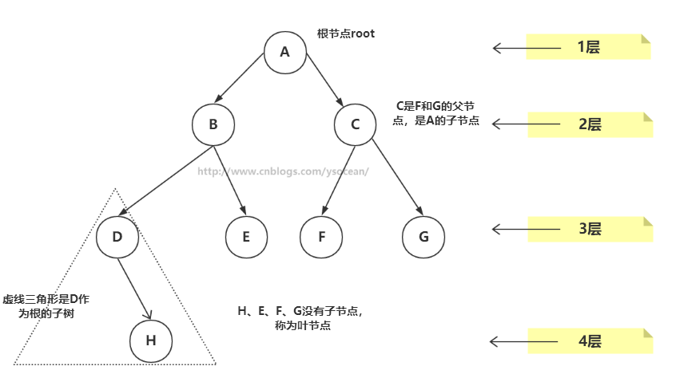

# 🌴 TREE DATASTRUCTURE

#### 🌲 BINARY TREE

> 

* > 📙性质
  > * 二叉树中，第 i 层最多有 2i-1 个结点
  > * 如果二叉树的深度为 K，那么此二叉树最多有 2K-1 个结点
  > * 二叉树中，终端结点数（叶子结点数）为 n0，度为 2 的结点数为 n2，则 n0=n2+1
* 二叉树分类
    * 🔴满二叉树  
      
        * 性质
          > * 满二叉树中第 i 层的节点数为 2n-1 个
          > * 深度为 k 的满二叉树必有 2k-1 个节点 ，叶子数为 2k-1
          > * 满二叉树中不存在度为 1 的节点，每一个分支点中都两棵深度相同的子树，且叶子节点都在最底层
          > * 具有 n 个节点的满二叉树的深度为 log2(n+1)

    * 🔴完全二叉树  
      
        * 性质
          > * 当 i>1 时，父亲结点为结点 [i/2] 。（i=1 时，表示的是根结点，无父亲结点）
          > * 如果 2*i>n（总结点的个数） ，则结点 i 肯定没有左孩子（为叶子结点）；否则其左孩子是结点 2*i 。
          > * 如果 2*i+1>n ，则结点 i 肯定没有右孩子；否则右孩子是结点 2*i+1
    * 🔴斜树  
      
* > 📙常用术语  
  

    * 路径：顺着节点的边从一个节点走到另一个节点，所经过的节点的顺序排列就称为“路径”。
    * 根：树顶端的节点称为根。一棵树只有一个根，如果要把一个节点和边的集合称为树，那么从根到其他任何一个节点都必须有且只有一条路径。A是根节点。
    * 父节点：若一个节点含有子节点，则这个节点称为其子节点的父节点；B是D的父节点。
    * 子节点：一个节点含有的子树的根节点称为该节点的子节点；D是B的子节点。
    * 兄弟节点：具有相同父节点的节点互称为兄弟节点；比如上图的D和E就互称为兄弟节点。
    * 叶节点：没有子节点的节点称为叶节点，也叫叶子节点，比如上图的H、E、F、G都是叶子节点。
    * 子树：每个节点都可以作为子树的根，它和它所有的子节点、子节点的子节点等都包含在子树中。
    * 节点的层次：从根开始定义，根为第一层，根的子节点为第二层，以此类推。
    * 深度：对于任意节点n,n的深度为从根到n的唯一路径长，根的深度为0；
    * 高度：对于任意节点n,n的高度为从n到一片树叶的最长路径长，所有树叶的高度为0；
* > 📙遍历  
  
    * 先序遍历
    * 中序遍历
    * 后序遍历
    * 层序遍历

    * 总结
        - 前序遍历：根结点—>左子结点—>右子结点，10、6、4、8、14、12、16
        - 中序遍历：左子结点—>根结点—>右子结点，4、6、8、10、12、14、16
        - 后序遍历：左子结点—>右子结点—>根结点，4、8、6、12、16、14、10
        - 层序遍历：第一层—>第二层—>第n层，10、6、14、4、8、12、16  

