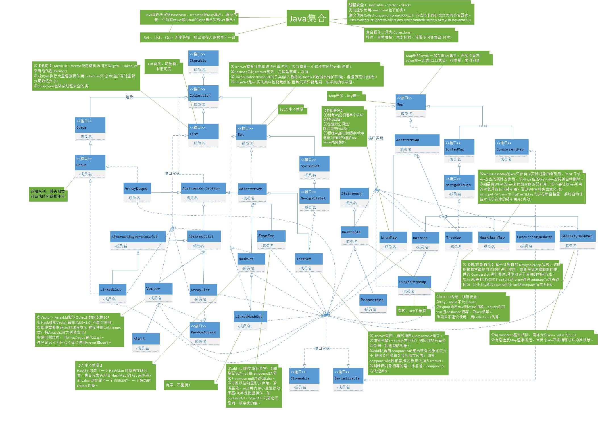
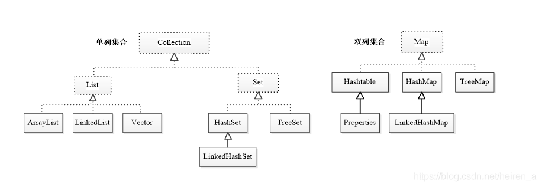

# java 基础

* 集合
    *
        * set
          > HashSet

          > TreeSet

          > LinkedHashSet

    *
        * list
          > ArrayList

          > LinkedArrayList
    *
        * map
          > LinkedHashMap

          > HashMap
            * 头插
            * rehash
            * 尾插
            * 分段锁
            * 红黑树
            * 退树
            * 退树

          > TreeMap

          > HashTable
          > > Properties

