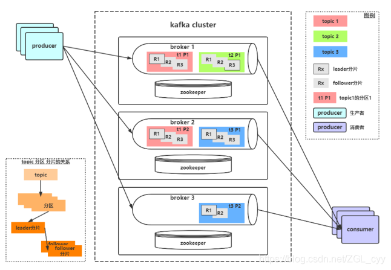

# KAFKA

### 🌸关键字（基本概念）

* 消息Message
  > Kafka 中的数据单元被称为消息message，也被称为记录records，可以把它看作数据库表中某一行的记录。

* topic
  > Kafka将消息分门别类，每一类的消息称之为一个主题（Topic）

* 批次
  > 为了提高效率， 消息会分批次写入 Kafka，批次就代指的是一组消息。

* 分区Partition-难点
  > 主题可以被分为若干个分区（partition），同一个主题中的分区可以不在一个机器上，有可能会部署在多个机器上，由此来实现kafka 的伸缩性。topic中的数据分割为一个或多个partition。每个topic至少有一个partition。每个partition中的数据使用多个文件进行存储。partition中的数据是有序的，partition之间的数据是没有顺序的。如果topic有多个partition，消费数据时就不能保证数据的顺序。在需要严格保证消息的消费顺序的场景下，需要将partition数目设为1。

* broker
  > 一个独立的 Kafka 服务器就被称为 broker，broker 接收来自生产者的消息，为消息设置偏移量，并提交消息到磁盘保存。

* Broker 集群
  > broker 是集群 的组成部分，broker 集群由一个或多个 broker 组成，每个集群都有一个 broker同时充当了集群控制器的角色（自动从集群的活跃成员中选举出来）。

* 副本Replica
  > Kafka 中消息的备份又叫做 副本（Replica），副本的数量是可以配置的，Kafka 定义了两类副本：领导者副本（Leader Replica） 和 追随者副本（Follower Replica）；所有写请求都通过Leader路由，数据变更会广播给所有Follower，Follower与Leader保持数据同步。如果Leader失效，则从Follower中选举出一个新的Leader。当Follower与Leader挂掉、卡住或者同步太慢，leader会把这个follower从ISR列表（保持同步的副本列表）中删除，重新创建一个Follower。

* Zookeeper
  > kafka对与zookeeper是强依赖的，是以zookeeper作为基础的，即使不做集群，也需要zk的支持。Kafka通过Zookeeper管理集群配置，选举leader，以及在Consumer Group发生变化时进行重平衡。

* 消费者群组Consumer Group
  > 生产者与消费者的关系就如同餐厅中的厨师和顾客之间的关系一样，一个厨师对应多个顾客，也就是一个生产者对应多个消费者，消费者群组（Consumer Group）指的就是由一个或多个消费者组成的群体。

* 偏移量Consumer Offset
  > 偏移量（Consumer Offset）是一种元数据，它是一个不断递增的整数值，用来记录消费者发生重平衡时的位置，以便用来恢复数据。

* 重平衡Rebalance
  > 消费者组内某个消费者实例挂掉后，其他消费者实例自动重新分配订阅主题分区的过程。Rebalance 是 Kafka 消费者端实现高可用的重要手段

### 🌸关键参数

生产者还有很多可配置的参数，在kafka官方文档中都有说明，大部分都有合理的默认值，所以没有必要去修改它们，不过有几个参数在内存使用，性能和可靠性方法对生产者有影响

* acks 指的是producer的消息发送确认机制
  > * __acks=0__：生产者在成功写入消息之前不会等待任何来自服务器的响应，也就是说，如果当中出现了问题，导致服务器没有收到消息，那么生产者就无从得知，消息也就丢失了。不过，因为生产者不需要等待服务器的响应，所以它可以以网络能够支持的最大速度发送消息，从而达到很高的吞吐量。
  > * __acks=1__：只要集群首领节点收到消息，生产者就会收到一个来自服务器的成功响应，如果消息无法到达首领节点，生产者会收到一个错误响应，为了避免数据丢失，生产者会重发消息。
  > * __acks=all__：只有当所有参与赋值的节点全部收到消息时，生产者才会收到一个来自服务器的成功响应，这种模式是最安全的，它可以保证不止一个服务器收到消息，就算有服务器发生崩溃，整个集群仍然可以运行。不过他的延迟比acks=1时更高。
  > * __retries__：生产者从服务器收到的错误有可能是临时性错误，在这种情况下，retries参数的值决定了生产者可以重发消息的次数，如果达到这个次数，生产者会放弃重试返回错误，默认情况下，生产者会在每次重试之间等待100ms
* enable.auto.commit
  > 该属性指定了消费者是否自动提交偏移量，默认值是true。为了尽量避免出现重复数据和数据丢失，可以把它设置为false，由自己控制何时提交偏移量。如果把它设置为true,还可以通过配置auto.commit.interval.ms属性来控制提交的频率。

* auto.offset.reset
  > * __earliest__：当各分区下有已提交的offset时，从提交的offset开始消费；无提交的offset时，从头开始消费
  > * __latest__：当各分区下有已提交的offset时，从提交的offset开始消费；无提交的offset时，消费新产生的该分区下的数据
  > * __none__：topic各分区都存在已提交的offset时，从offset后开始消费；只要有一个分区不存在已提交的offset，则抛出异常
  > * __anything else__：向consumer抛出异常
* enable.auto.commit被设置为true，提交方式就是让消费者自动提交偏移量，每隔5秒消费者会自动把从poll()方法接收的最大偏移量提交上去。提交时间间隔有auto.commot.interval.ms控制，默认值是5秒。
  __需要注意到，这种方式可能会导致消息重复消费。假如，某个消费者poll消息后，应用正在处理消息，在3秒后Kafka进行了重平衡，那么由于没有更新位移导致重平衡后这部分消息重复消费。__

  